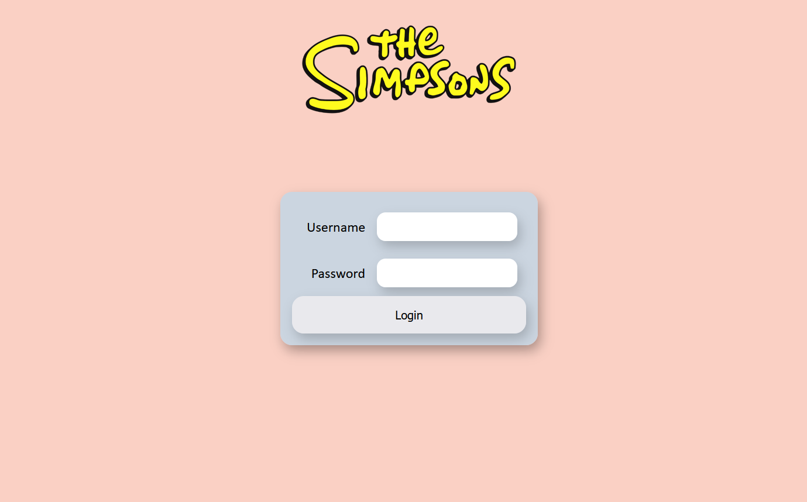
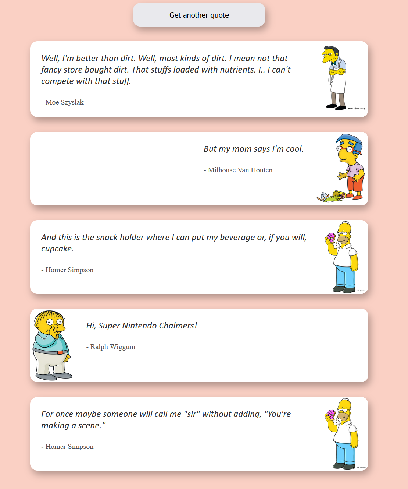

# The Simpsons App

A small app using the Simpson Quote API implemented using Laravel and Angular. A small architectural overview of the application
is available here: [Architecture](./docs/Architecture.pdf)

## Running the App

Please use Docker to run the App as follows:

`docker compose up -d`

The UI is available at http://localhost:5000

The Back-End API is available at http://localhost:8080/api 

Additionally, the OpenAPI documentation may be viewed at http://localhost:8080/api/documentation 

## Using the App

Upon starting the UI, you will be greeted with the following login form:

Please input the following credentials:

username: `test`

password: `password123`

You will then be redirected to the main page:

